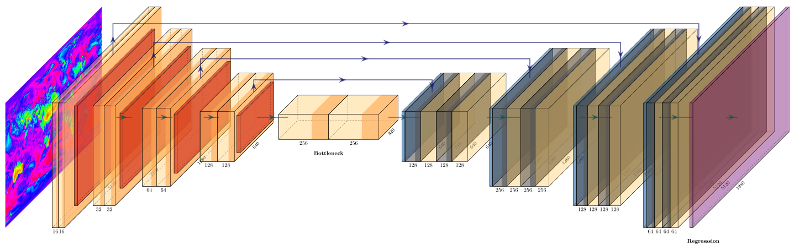

## Overview of Code Structure
[src/train.py](src/train.py) is a general-purpose training script. It works for variable length of input and prediction (with option `-in-days` and `-out-days`): Since there are four variables in FWI input, there are 4x number of input channels for each input day. Optionally the additional input, surface soil-moisture can be used as well.

[src/test.py](src/test.py) is a general-purpose test script. Once you have trained your model with `train.py`, you can use this script to test the model. It will load a saved model from `-checkpoint-file` and print and save the results to `logs` directory.

[src/dataloader](src/dataloader) directory contains all the modules related to data loading and preprocessing. To add a custom dataset class called `dummy`, you need to add a file called `dummy_dataset.py` and define a subclass `DummyDataset` inherited from `ModelDataset` defined in [src/dataloader/base_loader.py](src/dataloader/base_loader.py). You need to optionally implement six functions: `__init__` (initialize the class), `__len__` (return the size of dataset), `__getitem__`　(get a data point), `training_step` (forward pass during training), `validation_step` (forward pass during validation), and `test_step` (forward pass during inference). Now you can use the dataset class by specifying flag `-out dummy`. See example dataset [class](src/dataloader/fwi_reanalysis.py) for an example.

To add a new input variable:
* Add data loading implementation in Dataset.__init__().
* Update self.transforms in Dataset.__init__().
* Update input tensor generation in Dataset.__getitem__().
* Update self.in_channels in BaseModel.__init__() corresponding to the number of input variables.

* [fwi_forecast.py](src/dataloader/fwi_forecast.py) implements `__init__` specific to FWI Forecast data used for benchmarking purposes. (*Resolution: 2560x5120, 1 day*)
* [fwi_reanalysis.py](src/dataloader/fwi_reanalysis.py) implements `__init__`, `training_step`, `validation_step`, and `test_step` specific to FWI Reanalysis data along with the corresponding case-study coordinates. (*Forcings resolution: 640x1280, 1 day; Soil moisture Resolution: 600x1440, 3 days; FWI-Reanalysis resolution: 640x1280, 1 day*)
* [gfas_frp.py](src/dataloader/gfas_frp.py) implements `__init__`, `training_step`, `validation_step`, and `test_step` specific to FWI Reanalysis data along with the corresponding case-study. (*Resolution: 1800x3600, 1 day*)

The [model](src/model) directory contains modules related to objective functions, optimizations, and network architectures. To add a custom model class called `dummy`, you need to add a file called `dummy_model.py` and define a subclass `DummyModel` inherited from `BaseModel` defined in [base_model.py](src/model/base_model.py). You need to implement four functions: `__init__` (initialize the class; you need to first call `BaseModel.__init__(self, opt)`), `forward` (generate intermediate results), `training_epoch_end` (aggregation of training metrics and loss), `validation_epoch_end`(aggregation of validation metrics and validation loss), and `test_epoch_end` (Aggregation of inference metrics and test loss), and optionally `configure_optimizers` (tweak learning rate schedulers and optimizers). Now you can use the model class by specifying flag `-model dummy`. See example model [class](src/model/unet.py).

* [base_model.py](src/model/base_model.py) implements an abstract base class for models. It also includes commonly used helper functions (e.g., `training_epoch_end`, `validation_epoch_end`, `test_epoch_end`, `configure_optimizers`, `add_bias`, `prepare_data`), `train_dataloader`, `val_dataloader`, and `test_dataloader` which can be later used in subclasses.
* [unet.py](src/model/unet.py) implements the original U-Net architecture.
* [unet_downsampled.py](src/model/unet_downsampled.py) modifies the unet [model](src/model/unet.py) by downsampling the output to match with the resolution of fwi-reanalysis.
* [unet_snipped.py](src/model/unet_snipped.py) modifies the unet [model](src/model/unet.py) by removing the up-sampling layers once activation resolution matches with the resolution of fwi-reanalysis.
* [unet_tapered.py](src/model/unet_tapered.py) similar to [unet_snipped](src/model/unet_snipped.py) modifies the unet [model](src/model/unet.py) by removing the up-sampling layers once activation resolution becomes 1/4th the resolution of input. After the removal, feature compression layers are added which keep the resolution constant all along. The layers in the tapered end additionally have skip connections similar to [DenseNet](https://arxiv.org/abs/1608.06993).
* [unet_interpolated.py](src/model/unet_interpolated.py) modifies the unet [model](src/model/unet.py) for low resolution gfas-frp data which requires interpolation due to non-whole number scaling required in the final layer.

### Original U-net architecture

### U-net-tapered architecture (used for predicting FWI)

### U-net-interpolated architecture (used for predicting FRP)

